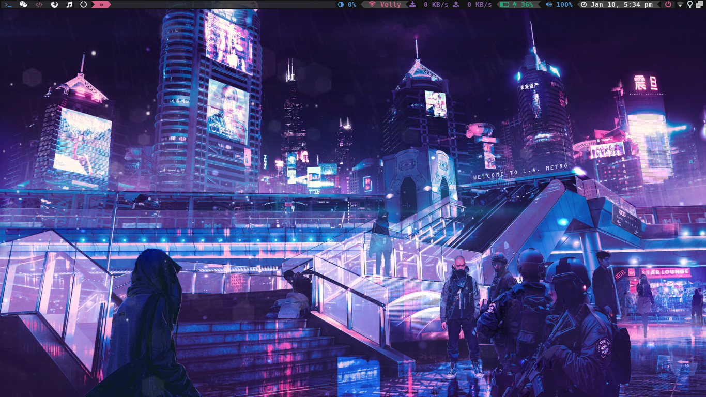

    ,---,                    ___                          ,--,                            
  .'  .' `\                ,--.'|_     .--.,    ,--,    ,--.'|                            
,---.'     \     ,---.     |  | :,'  ,--.'  \ ,--.'|    |  | :                            
|   |  .`\  |   '   ,'\    :  : ' :  |  | /\/ |  |,     :  : '                 .--.--.    
:   : |  '  |  /   /   | .;__,'  /   :  : :   `--'_     |  ' |       ,---.    /  /    '   
|   ' '  ;  : .   ; ,. : |  |   |    :  | |-, ,' ,'|    '  | |      /     \  |  :  /`./   
'   | ;  .  | '   | |: : :__,'| :    |  : :/| '  | |    |  | :     /    /  | |  :  ;_     
|   | :  |  ' '   | .; :   '  : |__  |  |  .' |  | :    '  : |__  .    ' / |  \  \    `.  
'   : | /  ;  |   :    |   |  | '.'| '  : '   '  : |__  |  | '.'| '   ;   /|   `----.   \ 
|   | '` ,/    \   \  /    ;  :    ; |  | |   |  | '.'| ;  :    ; '   |  / |  /  /`--'  / 
;   :  .'       `----'     |  ,   /  |  : \   ;  :    ; |  ,   /  |   :    | '--'.     /  
|   ,.'                     ---`-'   |  |,'   |  ,   /   ---`-'    \   \  /    `--'---'   
'---'                                `--'      ---`-'               `----'                

My various linux configurations

I'm currently using <b>bspwm</b> on Arch Linux.

<h2>Screenshot</h2>

