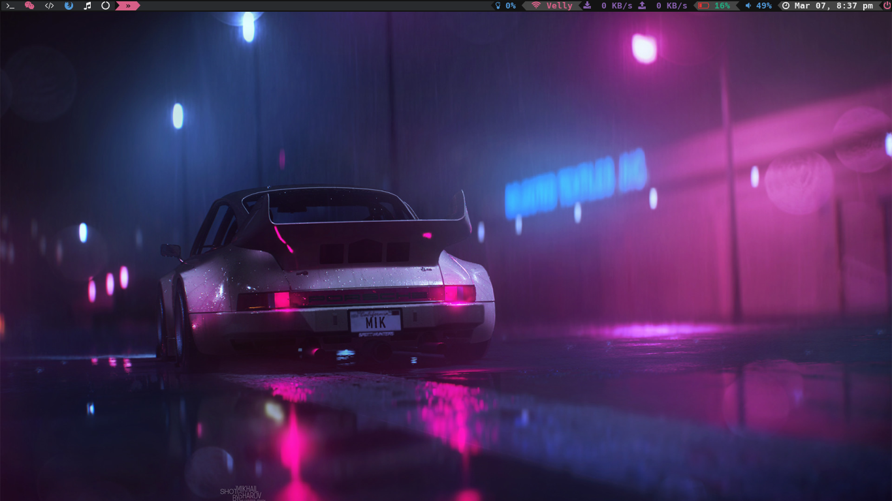

My various linux configurations

I don't use this setup anymore. 

Check [here](https://gitlab.com/lll2yu/dotfiles-naavi) to see my current setup.

I'm was using <b>bspwm</b> on Arch Linux.

#### Here's how it looked
<h2>Screenshot</h2>

